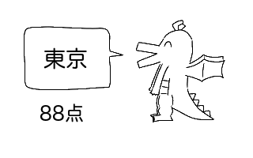

# 描いた都道府県発表ドラゴン

[都道府県の形状データ](https://tsukatte.com/category/building-map/map/)をもとに、入力画像の都道府県判定、及び点数計算を行う。



~~Web上で遊べる→ https://cvsemi2024.web.app~~ 終了しました

## 実行方法

ライブラリのダウンロード他
```bash
$ rye sync
```

都道府県データのクローリング
```bash
$ rye run python src/crawling.py
```

実行
```bash
$ rye run python src/main.py $input_filepath
```
